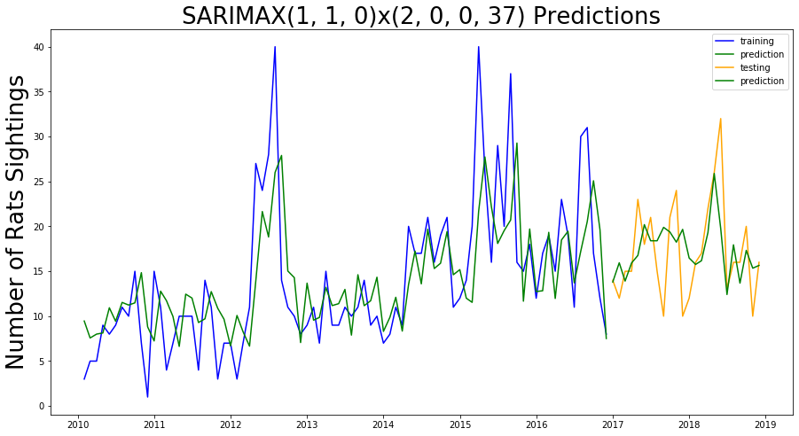

# Rats Sightings in Manhattan NYC

---

_Author: Zhan Yu_ 

## Table of Contents 

* [Problem Statement](#Problem-Statement)  
* [Executive Summary](#Executive-Summary)  
* [Modeling](#Modeling)  
* [Conclusion](#Conclusion)  
    - [Limitations](#Limitations)   
* [Source](#Source)  

## Problem Statement  

Rodents have always been a big health issue in NYC. Real estate companies consider rats as a factor of devaluate housing prices; restaurateurs believe that rats issue is the matter of survival in the industry.   

In this project, we are going to build a time series model to predict rats sightings for one zip code area NY 10002 which is lower east side include Manhattan Chinatown where a lot of restaurants located. We are building this model based on data from January, 2010 to December 2018. This model could help New York City Department of Health and Mental Hygiene (DOHMH) schedule rodent inspections without depending on 311 calls.   

We are using SARIMAX model which is a time series model incorporating Seasonality "S"and eXogenous features"X". The exogenous features are the number of restaurants and population based on zip code. We are going to split our data to training data from January, 2010 to December, 2016 and testing data from January, 2017 to December, 2018, and evaluate our model based on mean squared error(MSE).  

We are focus on Manhattan area using several datasets include [Rodent Inspection in NYC](https://data.cityofnewyork.us/Health/Rodent-Inspection/p937-wjvj) and [Rat Sightings](https://data.cityofnewyork.us/Social-Services/Rat-Sightings/3q43-55fe) from DOHMH and census data and [Business Patterns](https://www.census.gov/data/developers/data-sets/cbp-nonemp-zbp/zbp-api.2010.html) from [United States Census Bureau](https://www.census.gov/en.html).    

## Executive Summary  
**Data Gathering**  
The datasets Rodent Inspection in NYC and Rat Sightings are public datasets from data.cityofnewyork.us with we loaded by using Socrata. The census data are from United States Census Bureau which we use API key.   

**Data Preprocessing**  
We preprocess and clean our four datasets. Then we aggregate them to one dataset `exogenous.csv` which has all zip codes in Manhattan with time from 2010-01 to 2018-12 and the columns restaurant and population are our exogenous features for time series model SARIMAX.   

**Modeling**  
We look at ARIMA model first and then manual GridSearch (p, d, q) and (P, D, Q, S) for our SARIMAX model.  

## Modeling  
Since our model does not perform very good with ARIMA, we will introduce Seasonality "S"and two eXogenous features"X". First we are going to manually GridSearch (p, d, q) and (P, D, Q, S). 

Our prediction has less than 5 sightings error from root mean squared error(RMSE).

## Conclusion
From the root mean squared error(RMSE), overall we can say that our model performs well. This time series model to predict rats sightings for one zip code area NY 10002 can also be applied to all zip codes in NYC.

### Limitation   
- Neighborhoods with higher rates of active rat signs may not actually have higher rat populations but simply have more sightings and inspections.  
- Since the census data are annually, we assume that from Janurary to December each year, the numbers of restaurants and population are the same(e.g. from 2010-01 to 2010-12, numbers of restaurants in zip code 10002 keep the same as 600).   
- Our 2018 year restaurant data are estimated since they have not been out yet.   

## Source  
- [Business Patterns](https://www.census.gov/data/developers/data-sets/cbp-nonemp-zbp/zbp-api.2010.html)   
- [Rats in New York City](https://en.wikipedia.org/wiki/Rats_in_New_York_City)   
- [Rat Sightings](https://data.cityofnewyork.us/Social-Services/Rat-Sightings/3q43-55fe)   
- [Rodent Inspection in NYC](https://data.cityofnewyork.us/Health/Rodent-Inspection/p937-wjvj)   
- [United States Census Bureau](https://www.census.gov/en.html)   